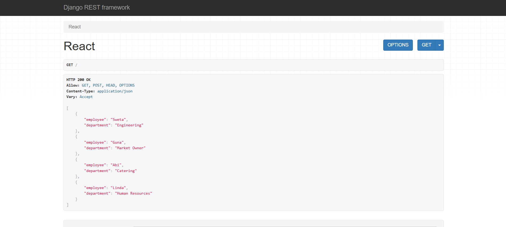
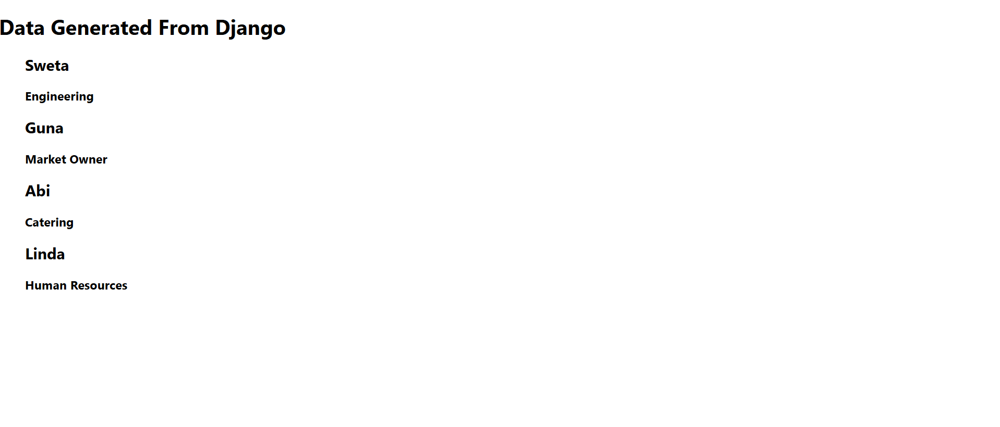

# 🚀 Django + React Integration App

This is a full-stack web application built using **Django (Backend)** and **React (Frontend)**. It demonstrates how to connect a Django REST API with a React frontend to send and receive data in JSON format.

📌 **Since this is my first Django project**, I focused on learning the basics of:

- Creating Django projects and apps
- Building RESTful APIs using Django REST Framework
- Handling JSON data through `APIView`
- Setting up and running a React frontend with API integration
- Managing frontend and backend servers concurrently

---

## ⚙️ Tech Stack

- **Backend:** Django 5.2, Django REST Framework
- **Frontend:** React (via Create React App or Vite)
- **Package Manager:** Pipenv (for Python dependencies), npm (for frontend)
- **Database:** SQLite (default)

---

## 📂 Features

- Simple API built with Django
- React frontend to POST and GET data
- Basic CORS setup and routing
- JSON request and response handling

